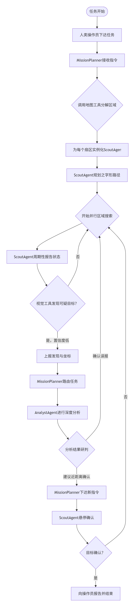

# 6.2 Multi-Agent Drone Task Design

A typical drone application scenario: "Search and Rescue Task"

We will use a multi-agent system to execute this task.

# Agent Roles and Design (ChatDev Pattern)

## MissionPlanner - Supervisor
- **Role**: Receives the search and rescue task objective from the operator.
- **Tools**:
  - Uses "graph tools" (functions that compute search areas) to plan the search grid.
- **Responsibilities**:
  - Instantiates multiple "Scout" agents, one per drone.
  - Divides the search area into a grid and assigns zones to each scout.

## ScoutAgent - Worker (one per UAV)
- **Role**: Receives a "task assignment" from the MissionPlanner.
- **Tools**:
  - Uses flight control tools (`fly_to_position`) and "vision tools" (functions that analyze images).
- **Responsibilities**:
  - Executes a high-altitude "sweep" flight path within the assigned zone.
  - Uses "vision tools" to analyze video feed (detecting people, vehicles, etc.).

## AnalystAgent - Specialist
- **Role**: Performs deeper analysis on low-confidence detections from scouts.
- **Tools**:
  - Advanced analysis tools such as image recognition, target identification, etc.
- **Responsibilities**:
  - When a scout is uncertain about a detection, the MissionPlanner forwards the image and data to the Analyst.
  - After analysis, the Analyst reports back to the MissionPlanner (e.g., "confirmed target" or "drone should get closer for better view").


## Workflow

### 1. Task Initiation
- **Description**: The operator sends the MissionPlanner an instruction: "Search area X for the target."

### 2. Task Decomposition and Assignment
- **Description**: The MissionPlanner calls the graph tool, divides the area into 4 zones, instantiates 4 ScoutAgents (Scout-1 through Scout-4), and sends each the instruction: "Search your assigned zone."

### 3. Parallel Execution
- **Description**: All 4 ScoutAgents begin searching their zones simultaneously, reporting position and status to the MissionPlanner (e.g., "Scout-2 in zone B, 30% complete").

### 4. Detection and Reporting
- **Description**: Scout-3's vision tool detects something, but confidence is low. It sends a message to the MissionPlanner: "Possible target at (x, y, z), confidence 60%, image attached."

### 5. Handoff (Control Transfer)
- **Description**: The MissionPlanner receives this message and decides to escalate. It sends the AnalystAgent a message: "Analyze Scout-3's image at position (x, y, z)."

### 6. Analysis and Feedback
- **Description**: The AnalystAgent analyzes the image and replies to the MissionPlanner: "Analysis result: 85% probability this is the target. Recommend Scout-3 descend for closer confirmation."

### 7. New Instructions
- **Description**: The MissionPlanner issues a new instruction to Scout-3: "Fly to (x, y, z), descend to 10m altitude, capture high-resolution video."

### 8. Task Completion
- **Description**: After Scout-3 confirms the target, the MissionPlanner reports to the operator while other ScoutAgents continue searching.

> This design combines supervisor coordination with agent handoffs for a flexible, scalable architecture.




## AirSim Environment Setup

Now let's set up the simulation environment. The goal is to provide a working multi-drone environment for the tutorial. We will use LangGraph and AirSim to implement a drone "search and rescue" scenario.


## Configure AirSim

First, we need to configure the AirSim simulator to generate a multi-drone environment. This is done by modifying AirSim's `settings.json` file, located in the `documentation/AirSim` folder.

The following JSON configuration will generate `"Drone1"` and `"Drone2"` at different starting positions when the simulation begins.

```json
{
  "SettingsVersion": 1.2,
  "SimMode": "Multirotor",
  "Vehicles": {
    "Drone1": {
      "VehicleType": "SimpleFlight",
      "X": 0,
      "Y": 0,
      "Z": 0,
      "Yaw": 0
    },
    "Drone2": {
      "VehicleType": "SimpleFlight",
      "X": 5,
      "Y": 0,
      "Z": 0,
      "Yaw": 0
    }
  }
}

```

After saving the content to settings.json, start the AirSim environment. You should see both drones in the scene.

## Connect and Verify
Next, use Python to verify the setup was successful. This connects to the simulator and uses the listVehicles() API to confirm that all drones were generated and are accessible.


```python
import sys
sys.path.append('../external-libraries')

import airsim

# Connect to AirSim simulator
client = airsim.MultirotorClient()
client.confirmConnection()

# List available drones
vehicle_names = client.listVehicles()
print(f"Successfully connected to AirSim. Available drones: {vehicle_names}")

# Expected output: Successfully connected to AirSim. Available drones: ['Drone1', 'Drone2']
```

Connected!
Client Ver:1 (Min Req: 1), Server Ver:1 (Min Req: 1)

Successfully connected to AirSim. Available drones: ['Drone1', 'Drone2']


If the drone list prints successfully, the multi-drone environment is set up correctly.


```python

```
