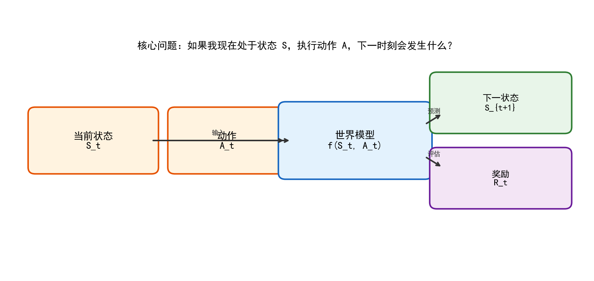
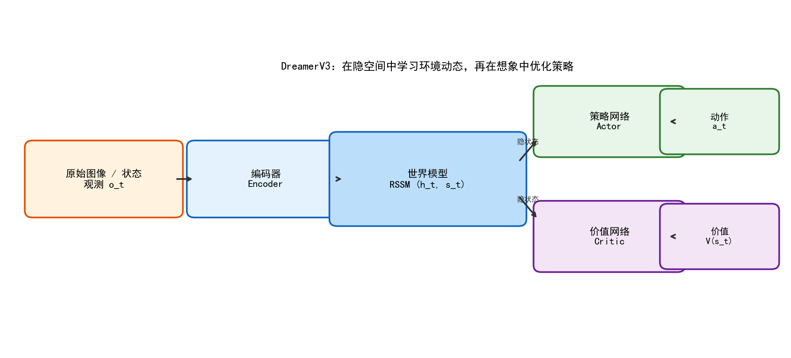
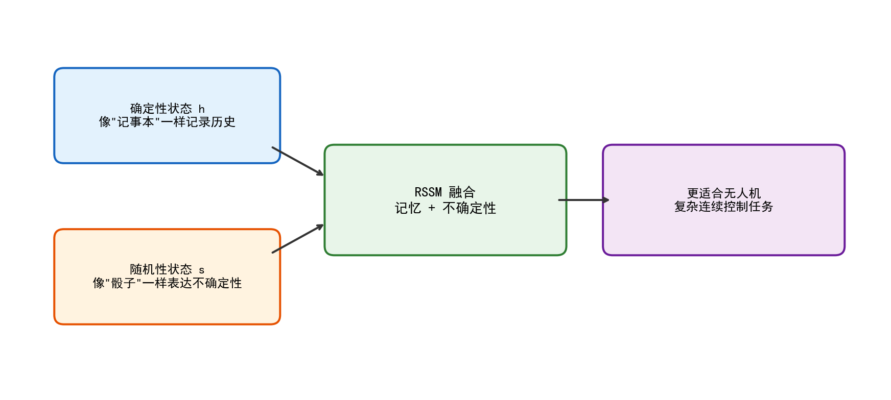
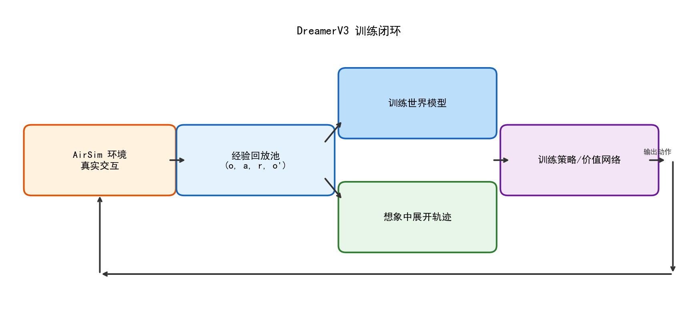
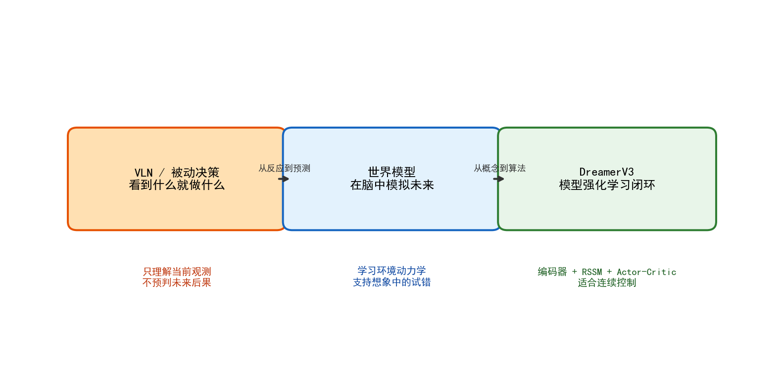
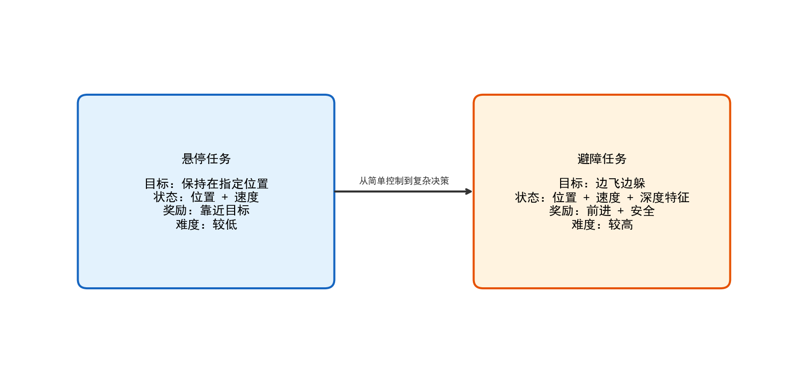
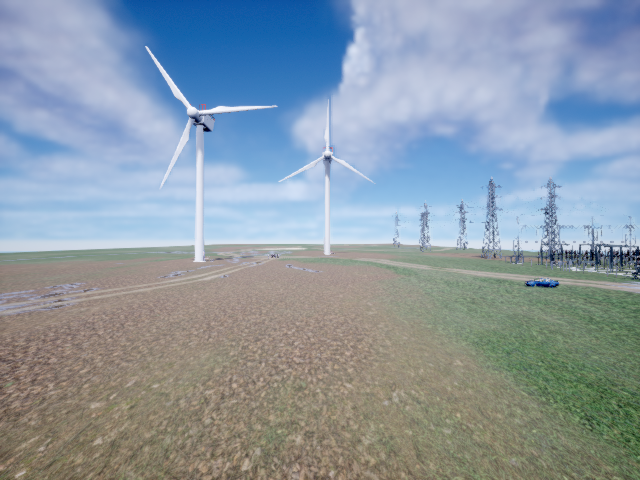
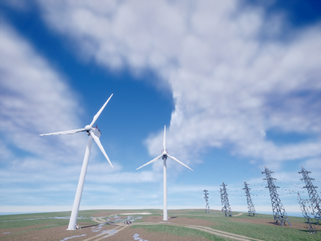

# # world model and droneapplication

## 8.1 from """"

in before chapter in, let large language model (LLM) and drone task, path planning and many. no is in,, is, above all in: ** for environment, agent. **

but, before method large many belongs to", for ". also is, need ** before **observation information below action. for many task, this method has; but,, control scene, this " by " will. 

with drone: 

- drone toward, according to before image i.e., can; 
- droneneed to, before error not, need to below position; 
- drone in environment in search, or obstacle avoidance, action not " before this frame", " will ". 

this - **world model (World Model) **. 

world model: 

> let agent not can " in ", able to" in in simulation". 

if -control is will "" new, that world model is will " before " high. able toaccording to before state and action, will, from many in that. 

for high, can world model **environmentsimulator**, is this simulator not is, is throughdata. in drone control within, outside "", in inside low. 

---

## 8.2 world model is 

### 8.2.1 defines

world model not is some, is classmethod. target is as followsmap: 

$$S_{t+1}, R_t = f(S_t, A_t)$$

its in: 

- $S_t$ represents before state (state) 
- $A_t$ represents before action (action) 
- $S_{t+1}$ represents below state
- $R_t$ representsreward (reward) 
- $f$ is world model

, this is below this: 

> if in in state $S_t$, andexecuteaction $A_t$, below will? 

in dronescene in, this "" few includingclassinformation: 

1. **state**: position is, velocity is, attitude is; 
2. ** this actionvalue not value**: is let dronetarget, is. 

### 8.2.2 with dronestate and action

let concept, can drone state and action. 

#### state (State) 

dronestate toward canincluding: 

- position: $x, y, z$
- velocity: $v_x, v_y, v_z$
- attitude: roll, pitch, yaw
- sensorinformation: image,, IMU etc.

in inside, use 6 state toward: 

```python
state = [x, y, z, vx, vy, vz]
```

in obstacle avoidancetask in, depth map statisticsstate, 12 state: 

```python
state = [x, y, z, vx, vy, vz,
left_mean, center_mean, right_mean,
left_min, center_min, right_min]
```

this explanation need: **state not is format, is task. **

#### action (Action) 

for many drone, actioncanrepresents: 

- pitch: before after 
- roll: 
- yaw_rate: yaw anglevelocity
- throttle: 

in inside, action 4 toward: 

```python
action = [pitch, roll, yaw_rate, throttle]
```

this also is DreamerV3 dronecontrol: **supportsaction space**, dronecontrol is control. 

### 8.2.3 world model not is "image", is ""

many # timesworld model, will with is " below frameimage". this its is. 

world model true need not is "graph", is will environment run. 

: 

- drone toward, will toward; 
- large, will above; 
- before, continue before large probability will; 
- if before velocity large, image above, also need before. 

this all is **environment**. world model value in: not is result, is "action—state— after " between. 

, can world model: 

> throughdata, agent in in call "virtual environment". 

---

## 8.3 droneneed toworld model

### 8.3.1 by 

in many visual navigation (VLN) or controlmethod in, agent is: 

1. before image; 
2. according toimageoutput action; 
3. executeaction; 
4. below frameimage. 

this method in, exploitation" before " information, has true "" concept. 

fordrone, this will with below: 

- ** short **: before above, not below not will above; 
- ****: must true, true, can action good not good; 
- **control not **: controltask in, action not long result. 

### 8.3.2 world model value

#### 1. in " in "

this can is world model need value. 

if has world model, agent can in true environment inside; has world model after, agentcan in within simulator in many action, good that execute. 

fordrone, this its key, because true high: 

- will; 
- will; 
- will training between; 
- in true above can bad. 

#### 2. high sample efficiency

reinforcement learning (Model-Based RL) no reinforcement learning (Model-Free RL) data. 

: 

- no method each, all need true; 
- world modelmethod few true dataenvironment, after can in "" inside trainingpolicy. 

forscene, this: 

- in has condition below; 
- in between within result; 
- "data——policy". 

#### 3. supportscontroltask

drone control is: 

- not is "/", is; 
- pitch, roll, yaw_rate all is; 
- position and velocity also is state. 

DreamerV3 this classworld modelmethod for control good, because not is action, is in between inside and. 

---

## 8.4 from no reinforcement learningreinforcement learning

### 8.4.1 classmethod for 

below is value: 

| for | no reinforcement learning | reinforcement learning |
|--------|----------------|--------------|
| | DQN, PPO, A2C | DreamerV3, PlaNet, World Models |
| | policy | environment, policy |
| data | high | for low |
| training | high | for low |
| | true environment many | |
| scene | data, environment | data, control, |

### 8.4.2 class

can this classmethodclass: 

- ** no reinforcement learning**: above true, times, times, slow slow will; 
- **reinforcement learning**: use simulator, in, above true. 

, simulator also not all true - this world model large: ** (Model Bias) **. 

### 8.4.3: world model 

world model not is, is. if this not, that agent in "" inside will good policy, true environment inside can not good use. 

this: 

- in errorgraph above " short "; 
- result, this its is. 

in after training in, will this: 

- policy in " in " reward high; 
- but true AirSim inside, can not policy. 

this not is failure, is above - let true, world model need. 

---

## 8.5 between: not pixel

### 8.5.1 image 

false let below frame RGB image. 

ifimage is 64×64, that frame RGB image is: 

$$64 \times 64 \times 3 = 12288$$

this each all need many value. moreover this value inside, many all and control not large, such as: 

-; 
-; 
- above; 
- and. 

, pixel will has need: 

1. ** high **: calculate and all large; 
2. ** many **: large pixel not; 
3. ****: compression, all can. 

### 8.5.2 between 

method is: high observationcompression low " between " inside, in between in. 



this processcan: 

```text
high observation o_t
↓ encoder Encoder
low state z_t
↓ world model f(z_t, a_t)
state z_{t+1}
↓ decoder Decoder () 
observation / image
```

above, encoder is "information": 

- not need; 
- for true key information; 
- low. 

### 8.5.3 between for dronecontrol 

for drone, true need not is pixel, is as followsinformation: 

- before is not is has; 
- before target has many; 
- attitude is; 
- is continue before all, is should, toward. 

this high information all cancompression low toward in. world model in this toward between in environment, will pixel high many. 

---

## 8.6 DreamerV3: world model in method

DreamerV3 is before has world modelmethod. and drone this classcontroltask, use. 

### 8.6.1 DreamerV3 

DreamerV3 can need: 

1. **encoder (Encoder) **
- inputimage/observation
- output low represents

2. **world model (World Model) **
- in between in environment
- state and reward

3. **policy network (Actor) **
- according to before stateoutputaction

4. **value network (Critic) **
- evaluation before state long value

as followsgraph: 



from, this "---evaluation": 

- encodercompressioninformation; 
- world modelsimulation; 
- Actor action; 
- Critic to. 

### 8.6.2 DreamerV3 drone

DreamerV3 dronetask, need has with below: 

#### 1. supportsaction space

dronecontrol not is "// before / after " this action, is valuecontrol: 

-; 
- pitch; 
- roll; 
- yaw_rate. 

DreamerV3 Actor canoutputaction, this classtask. 

#### 2. data high 

dronedataget high, DreamerV3 able tothroughworld model in in training, large few for true. 

#### 3., 

DreamerV3 encoder, world model, Actor, Critic,. can each,. 

---

## 8.7 RSSM: DreamerV3 

### 8.7.1 RNN not 

if use loopneural network (RNN / GRU / LSTM) world model, will has: 

- RNN long; 
- but state is all, not long environment in not deterministic. 

not deterministic. such as: 

- before is is? 
- sensor will not will state? 
- below will not will? 

this not deterministic, deterministic hidestate. 

### 8.7.2 RSSM 

RSSM all is **Recurrent State-Space Model**, can: 

> use "deterministic" + "stochasticvariable"description before state. 

its in: 

- **deterministicstate h**:, record; 
- **stochasticstate s**:, not deterministic. 

as followsgraph: 



### 8.7.3 RSSM advantages

this good is: 

- can; 
- can for many can; 
- and drone this classcontrol. 

from high angle, can RSSM: 

- RNN ""; 
- probabilitystate" can not ". 

this MLP or RNN true. 

---

## 8.8 DreamerV3 training

### 8.8.1 

DreamerV3 training not is data, is: 

1. in AirSim in and true environment; 
2. datareplay buffer; 
3. trainingworld model, let will; 
4. in world model"" in trainingpolicy and value network. 

as followsgraph: 



this key in: 

- environmentprovides true data; 
- world model true data"" large virtual environment; 
- Actor/Critic exploitation this virtual environment high training. 

### 8.8.2 replay buffer use 

replay buffer (Replay Buffer) record is: 

```python
(observation, action, reward, next_observation, done)
```

in implements inside, use as follows: 

```python
class ReplayBuffer:
def __init__(self, capacity=50000):
self.buffer = deque(maxlen=capacity)

def add(self, state, action, reward, next_state, done):
self.buffer.append((state, action, reward, next_state, done))
```

use has: 

1. **data**: sampling, not by between training; 
2. **exploitationdata**: datacan by many times use trainingworld model. 

### 8.8.3 training not in neural network

in in, will: 

> small in CPU above training not slow, true slow is AirSim. 

including: 

- each episode all need reset; 
- each times all need takeoff, moveToPosition; 
- obstacle avoidancetask each need outside depth map; 
- AirSim long between run can slow. 

this let can need: 

> true in, not, also can simulator, sensor and data. 

---

## 8.9 Notebook 1: world modelconceptintroduction

### 8.9.1 

`1-world_model_intro.ipynb` is + notebook, not AirSim, #. 

need is: 

- is world model; 
- droneneed toworld model; 
- world model and reinforcement learning is; 
- world model long. 

### 8.9.2 

defines world model: 

```python
class SimpleWorldModel(nn.Module):
def __init__(self, state_dim=6, action_dim=4, hidden_dim=64):
super().__init__()
self.net = nn.Sequential(
nn.Linear(state_dim + action_dim, hidden_dim),
nn.ReLU(),
nn.Linear(hidden_dim, hidden_dim),
nn.ReLU(),
)
self.state_head = nn.Linear(hidden_dim, state_dim)
self.reward_head = nn.Linear(hidden_dim, 1)
```

this, but world model: 

- input: state + action; 
- output: below state + reward. 

can " small use world model". 

### 8.9.3 this 

this need not is training many, is let as follows: 

- world model not is; 
-, is will function; 
- after has method (RSSM, DreamerV3) all is for this. 

---

## 8.10 Notebook 2: DreamerV3 

### 8.10.1 

`2-dreamerv3_deep_dive.ipynb` task not is AirSim, is DreamerV3 within. 

: 

- RSSM; 
- DreamerV3 large; 
- symlog and; 
- training data. 

### 8.10.2 RSSM 

Notebook in to RSSM: 

```python
class SimpleRSSM(nn.Module):
def __init__(self, obs_dim=32, action_dim=4, h_dim=64, s_dim=32):
super().__init__()
self.gru = nn.GRUCell(s_dim + action_dim, h_dim)
self.prior_net = nn.Sequential(...)
self.posterior_net = nn.Sequential(...)
```

this is, but RSSM key: 

- through GRU deterministicstate; 
- throughprobability distributionstochasticstate. 

### 8.10.3 this this 

high this, few should can: 

1. DreamerV3 not in pixel between; 
2. need to RSSM, not is MLP; 
3. Actor and Critic in world model in. 

if this can,. 

---

## 8.11 Notebook 3: (inference) 

### 8.11.1 taskdefines

task target: 

> let drone in position can. 

although this task above, but contains control in also key: 

- position; 
- velocity; 
- attitude; 
- can. 

### 8.11.2 reward function

use as followsreward: 

| condition | reward | |
|------|------|------|
| in targetposition | +1.0/step | |
| attitude large | -0.1/step | not |
| or edge | -10.0 | |

from angle, this classreward function: 

> targetreward + stability + all. 

### 8.11.3 policy for 

in notebook in, classpolicy: 

1. **action**: all has can, below; 
2. **PD control**: control; 
3. **MPC / world modelpolicy**: in in evaluation many action after execute. 

this is good, because can let: 

- policy not; 
- control in task above; 
- world modelmethod advantages in inside. 

---

## 8.12 Notebook 4: obstacle avoidance (inference) 

### 8.12.1 obstacle avoidance

task is " in ", obstacle avoidancetask is "edgeedge". 

this need target: 

- ** toward before **; 
- ** not need above **. 

is, reward function not is target, is many target: 

| condition | reward |
|------|------|
| toward before distance | +1.0/step |
| | -1.0/step |
| | -100.0 |

### 8.12.2 depth map need 

obstacle avoidancetask information is depth map. 

RGB image also can, but, depth map to " before many has ". this for control high. 

in notebook in, has depth map, is 6 statistics: 

- / in /; 
- / in / small. 

this is: 

- obstacle avoidance key between; 
- large large low state; 
- "" and "". 

### 8.12.3 world model"" in obstacle avoidance in use 

obstacle avoidance can world model value, because" before " not " below also not will ". 

good world modelshouldable to before: 

- ifcontinue, will not will; 
- if, before is all; 
- if, is can many between. 

this also is obstacle avoidancetask can world modelmethod above, but also and simulatorstability. 

---

## 8.13 Notebook 5: from training

### 8.13.1 trainingprocess

`5-train_hover.ipynb` is has value, because reinforcement learning training: 

1. policydata; 
2. use datatrainingworld model; 
3. in in trainingpolicy network; 
4. AirSim in inferenceverify. 

### 8.13.2 key: 

this need, not is "trainingsuccess ", is can below this: 

- world modeltrainingloss below; 
- in reward above; 
- but true AirSim in policy not good. 

this is. 

in test in, this: 

- in reward high; 
- true environment inside, training after Actor has not policy. 

this explanation key: 

> trainingworld model, not etc.training use policy. 

### 8.13.3 MPC: world model another use 

in this inside, need for: **MPC (control) **. 

and its training Actor, not each all in sampling many action, use world modelevaluation short after, good actionexecute. 

this is: 

- for world model precision need for low; 
- not in error inside " long overfitting"; 
- control in in. 

, from angle, this above use world model method: 

| method | features |
|------|------|
| Actor policy | training, deploy fast, but |
| MPC in | each all, deploy slow, but |

---

## 8.14 Notebook 6: from trainingobstacle avoidance

### 8.14.1 "process notebook"

and Notebook 5 not, Notebook 6 in above not. need not in neural network, in simulation: 

- each all need depth map; 
- each episode all need reset + takeoff + moveToPosition; 
- obstacle avoidancetask long,; 
- AirSim long between. 

, this: 

> **trainingprocess notebook + short sanity check notebook**

### 8.14.2 

in above, need complete with below: 

1. 1~2 short episode, confirmdepth map, state, reward function; 
2. trainingloop, not all iteration. 

### 8.14.3 datasolution

low for AirSim long between stability, use solution: 

1. in AirSim in short between data, save `.npz`; 
2. after training not connect AirSim, is from dataread; 
3. environment and training after, trainingstability will. 

this also is in use - simulator"data", not is training all in. 

---

## 8.15 graph

### graph 8-1 from VLN world model 



this graph: from """ in in simulation". 

### graph 8-2 world model


this graph for: 

$$S_{t+1}, R_t = f(S_t, A_t)$$

### graph 8-3 DreamerV3 


this graphcan graph, encoder, world model, Actor, Critic. 

### graph 8-4 RSSM graph


this graph RSSM " + ",. 

### graph 8-5 DreamerV3 training


this graphtrainingprocess, is "reinforcement learning" need graph. 

### graph 8-6 and obstacle avoidancetask for 



this graph: obstacle avoidancetasktask, can world model value, also. 

### graph 8-7 AirSim in taskscene



this graph for task. although from above is in in not, but for control, this need to and attitude and small. 

### graph 8-8 AirSim in before toward / obstacle avoidancescene



obstacle avoidancetask in: drone not need toward before, need according to before environmentaction. also because, obstacle avoidance can world model "" can. 

### graph 8-9 depth map


depth map " before distance has many "encodingpixel, is obstacle avoidancetask in key input. RGB image, depth mapcontrol and. 

---

## 8.16 below summary

### 8.16.1 world model not is " can "

world model large, but not is above. altitude: 

- data; 
-; 
- training; 
- simulation and true environment. 

### 8.16.2 value

use `SimpleWorldModel` and `SimpleRSSM` all is implements, not true DreamerV3 large. but value not in " can ", in: 

- short; 
-; 
- let,,; 
- can, in, training etc.key. 

### 8.16.3 true let will 

if need use target, that is: 

> not is need will " DreamerV3 ", need true: world model can drone good, as well as in true in will limitations. 

---

## 8.17 small 

"world model and droneapplication", from concept, from path. need contentincluding: 

1. world model: environment, in in simulation; 
2. explanation reinforcement learning for no reinforcement learning advantages and; 
3. introduction DreamerV3, includingencoder, RSSM, Actor, Critic; 
4. through and obstacle avoidance task, world model in dronecontrol in application; 
5. throughtraining, let this key; 
6. from angle AirSim stability, datasolution and edge. 

if before is "multi-agent", that this is: 

> ** agent "" can. **

this, good drone can course need toward: 

- toward " many agent"; 
- another toward " agent". 

in high in, this toward will: 

- many drone in each drone, all can has world model; 
- drone, also can high times world model; 
- world model not cancontrol, also can and. 

this also, is. true has, in world model, reinforcement learning, control and multi-agent. 
