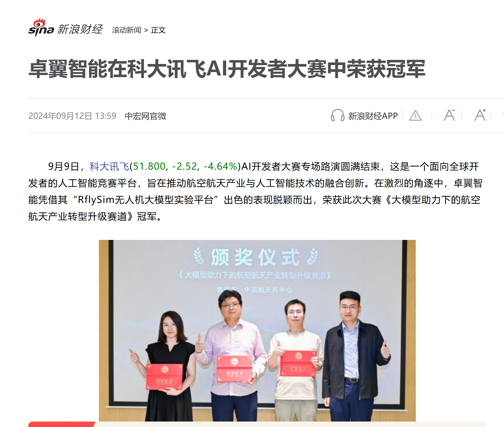
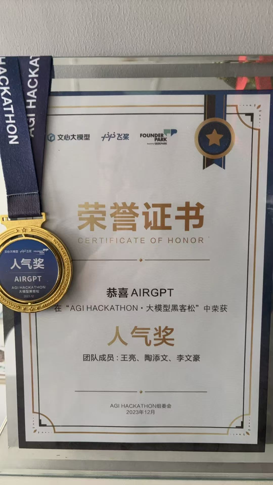

# courseintroduction

## 1 need 

let drone above LLM, AI+drone new 

natural languageLLM in control. course with AirSimsimulation, LLM, GPT and multimodaltechnology, build"--control" all drone can. from controltask all process, 100%open-source, deploy true drone. 

need to this course? 

dronecontrol in from can control toward LLM can 

2024GPT-4o, deepseek etc.multimodal, droneprovides"+"inference can 

AirSimopen-source dronesimulation, is LLMtraining 

drone+LLM new, this course, based onprompt, agent, many agent, multimodal etc. need droneLLMapplication toward, candroneLLMcourse. 

course course, with simulation, after will another outside set deploycourse. 

## 2 course

with, use, let large after i.e. use,,,: 

: use Pythoninterface/API, AirSim API use class

use: each can provides small runinstance

: from promptapplicationmultimodal LLM in drone in application

tutorial toward: 

1 calculate,, control, drone etc., etc.. 

2 no, drone, etc.LLM. droneLLM, can application

## 3 course large 

# AirSimdevelopment environment

1.1 development environment

1.2 AirSimsimulation

1.3 AirSim dronecontrol

1.4 AirSim drone

1.5 Airsim many dronecontrol

# based onprompt dronecontrol

2.1 dronesdk

2.2 OpenAI etc.SDKcall

2.3 LLMprompt engineering

2.4 flight control- above 

2.5 instruction-wind turbine

2.6 task- can 

# multimodalapplication

3.1 imageLLM and use 

3.2 based on autonomous flight- good 

3.3 object detectionLLM and application

3.4 based on autonomous flight- small 

# Agentapplication

4.1 LLMAgent

4.2 Smolagents use 

4.3 based onAgent within 

4.4 airsimcamera

4.5 based onAgent within search

# can 

5.1 speech recognitionLLMapplication

5.2 based onvoice control drone (upload) 

5.3 gradio

5.4 within search (gradioinput) 

# no task (update, content) 

6.1 dronetask

6.2 many drone

6.3 large 

6.4 based onLLM drone

6.5 low 

above is course all content, will update, according to large not, " no +LLM" course. 

## course

becausedrone+LLM for new, use course LLM, all can. 

