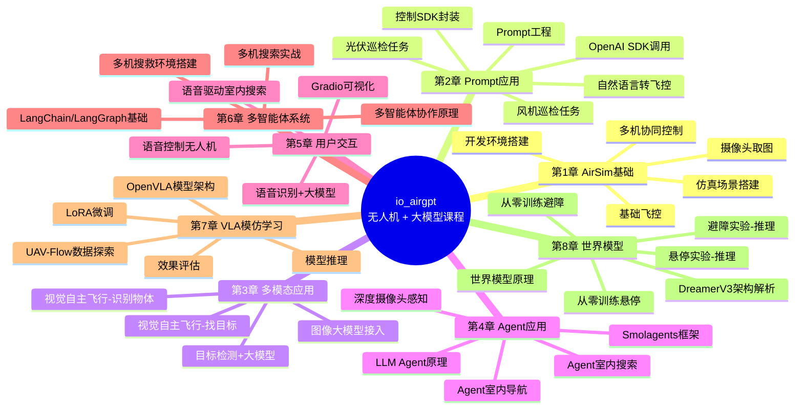

# io_airgpt：无人机 + 大模型实战课程

用自然语言控制无人机——这门课程带你把 AirSim 无人机仿真、LLM/多模态大模型、Prompt 工程、Agent、多智能体、语音交互，一路做到 VLA 模仿学习和世界模型，搭出一套完整的"大模型 + 无人机"技术栈。全程开源，最终可以部署到真实无人机上。

## 为什么做这门课

2024 年之后 GPT-4o、DeepSeek 等多模态大模型让"推理决策"能力大幅提升，而无人机恰好是一个理想的具身智能载体：控制维度不多、场景直观、又足够贴近真实机器人问题（感知、规划、避障、多机协同）。这门课就是把大模型的推理能力和无人机的控制能力接起来，从最基础的飞控 API，一路带到 Agent、多智能体协作、语音交互，再到模仿学习和世界模型这类更前沿的方向。

课程全部基于仿真环境（AirSim），零硬件成本即可跟练；后续会有配套的真机部署教程。

## 环境要求

- 硬件：16GB 内存起步，建议有 GPU，预留 50GB 以上磁盘空间
- 系统：推荐 Windows 11（macOS / Linux 需自行编译 AirSim）
- 开发环境：Conda + Python 3.10 + JupyterLab
- LLM API：推荐 DeepSeek，或任意兼容 OpenAI SDK 的多模态模型服务

详细安装步骤见 [`1-airsim_basic/1-dev_env.ipynb`](1-airsim_basic/1-dev_env.ipynb)。

## 课程大纲

| 章节 | 主题 | 内容 |
| --- | --- | --- |
| [1-airsim_basic](1-airsim_basic) | AirSim 基础 | 开发环境搭建、仿真场景、无人机基础飞控（起降/航点/悬停）、摄像头取图、多机协同控制 |
| [2-prompt_app](2-prompt_app) | 基于 Prompt 的无人机控制 | 无人机控制 SDK 封装、OpenAI SDK 调用、Prompt 工程、自然语言转飞控指令、复杂任务链（风机巡检、光伏巡检） |
| [3-mulitmode_app](3-mulitmode_app) | 多模态应用 | 图像大模型接入、基于视觉的自主飞行、目标检测 + 大模型联动、"找目标物"任务实战 |
| [4-agent_app](4-agent_app) | Agent 应用 | LLM Agent 原理、Smolagents 框架实践、Agent 驱动的室内自主导航与搜索、深度摄像头感知 |
| [5-user_app](5-user_app) | 用户交互应用 | 语音识别接入大模型、语音控制无人机、Gradio 可视化界面、语音驱动的室内搜索 |
| [6-multi_agent](6-multi_agent) | 多智能体系统 | 多智能体协作原理、多机搜救任务环境搭建、LangChain/LangGraph 基础、基于 LangGraph 的多机搜索 |
| [7-done-VLN](7-done-VLN) | VLA 模仿学习 | UAV-Flow 数据集探索、OpenVLA 模型架构、LoRA 微调、推理与效果评估 |
| [8-world_model](8-world_model) | 世界模型 | 世界模型原理、DreamerV3 架构解析、悬停/避障推理实验、从零训练悬停与避障模型 |

> 课程仍在持续更新中，会跟进业界最新进展，逐步补充更多"无人机 + LLM"的实战方向。

## 课程脑图

## 目录结构

- `1-airsim_basic` ~ `8-world_model`：八章课程 Notebook 及配套代码
- `airsim` / `ernie_airsim`：AirSim 及文心大模型相关的辅助脚本、示例
- `external-libraries`：AirSim Python SDK 等第三方依赖（避免和 JupyterLab 依赖冲突，直接源码引入）
- `prompts` / `system_prompts`：各课程用到的 Prompt 模板与系统提示词
- `match`：整理后的配套项目代码合集（含真机 Tello 飞行示例）
- `img` / `img2`：课程用到的图片素材

## 效果展示

