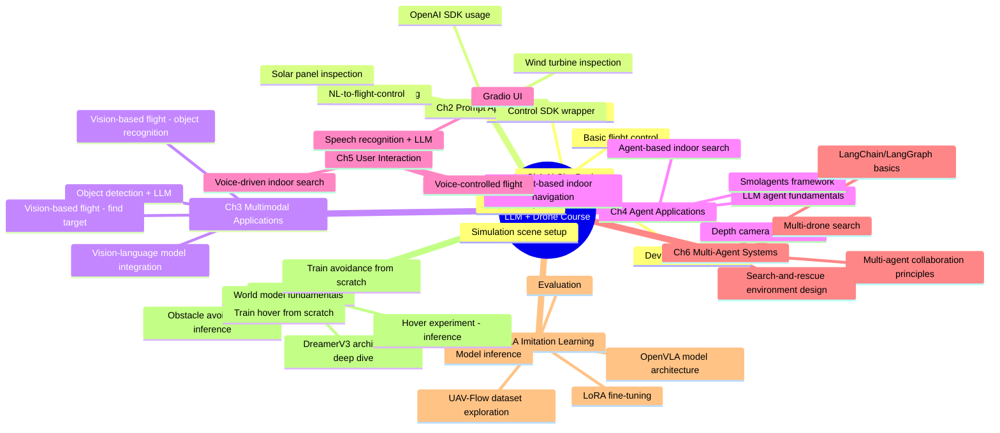

# io_airgpt: LLM + Drone Hands-on Course

Control a drone with natural language. This course walks you through AirSim drone simulation, LLM/multimodal models, prompt engineering, agents, multi-agent systems, and voice interaction, all the way to VLA imitation learning and world models — building a complete "LLM + drone" stack. Fully open source, and deployable on a real drone.

## Why this course

Since 2024, multimodal LLMs like GPT-4o and DeepSeek have made a big jump in reasoning and decision-making. Drones turn out to be an ideal embodied-AI testbed: low-dimensional control, intuitive scenarios, and close enough to real robotics problems (perception, planning, obstacle avoidance, multi-vehicle coordination). This course connects LLM reasoning to drone control — starting from basic flight-control APIs, moving through agents, multi-agent collaboration, and voice interaction, and ending with more cutting-edge topics like imitation learning and world models.

The whole course runs in simulation (AirSim), so there's zero hardware cost to follow along. A real-drone deployment guide is planned as a follow-up.

## Requirements

- Hardware: 16GB RAM minimum, a GPU is recommended, 50GB+ free disk space
- OS: Windows 11 recommended (macOS/Linux require building AirSim from source)
- Dev environment: Conda + Python 3.10 + JupyterLab
- LLM API: DeepSeek recommended, or any multimodal model service compatible with the OpenAI SDK

See [`1-airsim_basic/1-dev_env.ipynb`](1-airsim_basic/1-dev_env.ipynb) for detailed setup steps.

## Course Outline

| Chapter | Topic | Content |
| --- | --- | --- |
| [1-airsim_basic](1-airsim_basic) | AirSim Basics | Dev environment setup, simulation scenes, basic flight control (takeoff/landing, waypoints, hover), camera capture, multi-vehicle coordination |
| [2-prompt_app](2-prompt_app) | Prompt-Based Drone Control | Drone control SDK wrapper, OpenAI SDK usage, prompt engineering, natural-language-to-flight-control, complex task chains (wind turbine inspection, solar panel inspection) |
| [3-mulitmode_app](3-mulitmode_app) | Multimodal Applications | Vision-language model integration, vision-based autonomous flight, object detection + LLM, "find the target" mission |
| [4-agent_app](4-agent_app) | Agent Applications | LLM agent fundamentals, Smolagents framework, agent-driven indoor navigation and search, depth camera perception |
| [5-user_app](5-user_app) | User Interaction | Speech recognition + LLM, voice-controlled flight, Gradio UI, voice-driven indoor search |
| [6-multi_agent](6-multi_agent) | Multi-Agent Systems | Multi-agent collaboration principles, search-and-rescue environment design, LangChain/LangGraph basics, LangGraph-based multi-drone search |
| [7-done-VLN](7-done-VLN) | VLA Imitation Learning | UAV-Flow dataset exploration, OpenVLA model architecture, LoRA fine-tuning, inference and evaluation |
| [8-world_model](8-world_model) | World Models | World model fundamentals, DreamerV3 architecture deep dive, hover/obstacle-avoidance inference experiments, training hover and avoidance models from scratch |

> This course is under active development and will keep incorporating new industry progress into more "drone + LLM" hands-on tracks.

## Course Mindmap

## Directory Structure

- `1-airsim_basic` ~ `8-world_model`: notebooks and code for each of the 8 chapters
- `airsim` / `ernie_airsim`: AirSim and ERNIE (Baidu LLM) related helper scripts and examples
- `external-libraries`: third-party dependencies such as the AirSim Python SDK, vendored directly to avoid a tornado version conflict with JupyterLab
- `prompts` / `system_prompts`: prompt templates and system prompts used across the course
- `match`: a consolidated set of companion project code (includes a real Tello drone flight example)
- `img` / `img2`: images used throughout the course

## Demo

