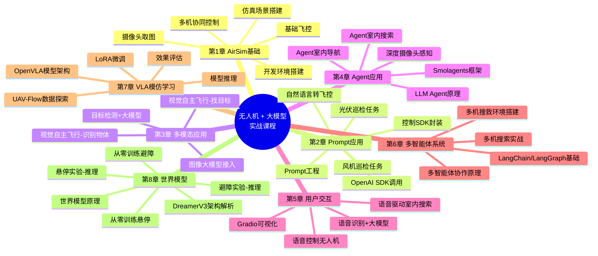

# 当大模型学会"开飞机"：一门把 LLM 变成无人机大脑的实战课

## 为什么现在做这门课

2024 年之后，多模态大模型的推理能力出现了一次质变——GPT-4o、DeepSeek 这类模型不再只是"聊天工具"，而是开始具备看图、理解场景、拆解任务、给出行动指令的能力。与此同时，具身智能（Embodied AI）成了行业里最热的方向之一，从人形机器人到自动驾驶，大家都在琢磨怎么把"大模型的脑子"接到"机器的身体"上。

无人机在这波浪潮里其实是一个被低估的最佳载体：

- 控制维度不复杂（几个坐标 + 姿态），但任务场景一点不简单——巡检、搜救、避障、编队，样样都是真实机器人问题的缩影；
- 有成熟、免费、跨平台的仿真环境（AirSim），零硬件成本就能上手，不用担心炸机；
- 从"自然语言控制单机"到"多机协同"再到"模仿学习/世界模型"，恰好能把当前 LLM 应用的几条主线（Prompt 工程、Agent、多智能体、语音交互、VLA、World Model）串成一条完整的技术路径。

换句话说：这不是一门"教你飞无人机"的课，而是一门借无人机这个具体载体，把当下大模型应用最核心的几种范式全部实战一遍的课。学完之后，你迁移到任何"大模型 + 硬件/机器人"的场景，都能直接复用这套方法论。

## 课程背景与荣誉

这门课不是关起门来写的教案，而是在真实比赛和真实课堂里反复打磨出来的：

- **算力合作**：课程与去中心化算力平台 io.net 合作，其开源大模型推理服务对课程学员免费开放，降低了大家跑多模态大模型、做微调实验的门槛，仿真训练、VLA 微调这些原本"烧卡"的环节也能顺畅跑起来；
- **拿奖拿到手软**：项目获得 io.net 黑客松一等奖、百度大模型开发者大赛人气奖等多项奖项，技术方案受到了行业和平台方的双重认可；
- **线下实战检验**：课程在中法航空学院暑期班进行过完整的线下授课，从环境搭建到多智能体协同全流程带教，学员反馈一致好评，课程内容和节奏也是根据线下真实教学效果持续打磨迭代的。

## 课程特色

- **全流程开源、全仿真跟练**：基于 AirSim 仿真环境，不需要买无人机、不用担心摔机，代码和数据全部开源，可以直接 clone 跑起来。
- **有免费算力兜底**：依托与 io.net 的合作，课程用到的开源大模型推理服务免费提供给学员，多模态调用、Agent 反复试错、VLA 微调都不用担心 API 费用。
- **从 Prompt 到 Agent 再到多智能体，路径完整**：不是零散的技巧堆砌，而是按"能力递进"设计——先让 LLM 会调用函数，再让它具备感知-决策闭环（Agent），再到多个 Agent 协作（多智能体），逐层加难度。
- **覆盖当下最前沿的两个方向**：VLA（视觉-语言-动作模型，OpenVLA 微调）和 World Model（世界模型，DreamerV3），这两块是目前具身智能领域最活跃的研究方向，课程直接给到可运行的实践代码。
- **理论 + 代码 + 真机部署路径**：每一章都是 Notebook 形式，边讲原理边跑代码；仿真部分完成后，还有真机（Tello）飞行的配套示例，理论不悬空。

## 先修要求

- 会写 Python，能看懂基本的面向对象代码即可，不需要机器人或控制理论背景；
- 了解 LLM 的基本调用方式（比如用过 OpenAI API 或类似的对话接口）会更顺畅，没用过也能跟着课程从零学；
- 到后半程（Agent、多智能体、VLA、世界模型）会涉及一些强化学习和深度学习的基础概念，建议对神经网络训练流程有基本认知；
- 硬件上：16GB 内存起步，建议有 GPU（尤其是最后世界模型训练那一章），50GB 以上磁盘空间，推荐 Windows 11。

## 课程目标

学完这门课，你应该能够：

1. 独立搭建 AirSim 仿真环境，用代码完成无人机的基础飞控、感知、多机控制；
2. 设计 Prompt，让 LLM 把自然语言指令转换成可执行的飞控代码，并处理歧义、追问等真实交互问题；
3. 接入多模态大模型，让无人机具备"看图做决策"的能力，完成基于视觉的自主飞行任务；
4. 理解并实现 Agent 的感知-决策-执行闭环，用 Agent 框架完成室内导航、搜索等复杂任务；
5. 设计多智能体协作系统，让多台无人机分工完成搜救等任务；
6. 了解 VLA 模型的微调流程，以及世界模型（DreamerV3）的原理和从零训练方法。

## 适合谁来学

- 计算机、自动化、机器人、人工智能相关专业的学生，想通过一个具体项目把"大模型应用开发"这条线完整跑通；
- 已经会用 LLM API 做一些应用，但想往 Agent、多智能体、具身智能方向深入的开发者；
- 对无人机、机器人感兴趣，想知道"大模型到底怎么控制硬件"的爱好者；
- 需要一个课程设计/毕业设计选题，且希望方向新、代码可复现的同学。

## 课程脑图

## 课程主要内容

课程一共 8 章，按能力递进设计：

**第 1 章 AirSim 基础**：搭环境，学 SDK，让无人机能起降、飞航点、多机协同——这是后面所有章节的地基。

**第 2 章 Prompt 应用**：把无人机控制函数封装成"工具"，用 Prompt 工程让 LLM 把"飞到风机旁边巡检"这类自然语言指令，转换成可执行的飞控代码。

**第 3 章 多模态应用**：接入多模态大模型，让无人机不再依赖仿真器"作弊式"获取坐标，而是真正"用摄像头看世界"，通过视觉识别目标完成自主飞行。

**第 4 章 Agent 应用**：从"一问一答"升级到 OODA 闭环（观察-判断-决策-行动），用 Smolagents 等框架实现能自主感知、规划、执行的 Agent，完成室内导航和搜索任务。

**第 5 章 用户交互应用**：加入语音识别，让"说话"成为控制入口，并用 Gradio 搭建可视化交互界面，做出一个真正能演示的产品原型。

**第 6 章 多智能体系统**：单机能力有限，这一章设计"搜救任务"式的多智能体系统——规划者、执行者、分析者分工协作，并用 LangGraph 落地多机协同搜索。

**第 7 章 VLA 模仿学习**：进入模仿学习领域，基于 UAV-Flow 数据集，用 LoRA 微调 OpenVLA 模型，让模型直接从图像 + 指令端到端输出飞行动作，是目前机器人学习最前沿的方向之一。

**第 8 章 世界模型**：介绍基于模型的强化学习——用 DreamerV3 这样的世界模型在"想象"中训练策略，再迁移到真实仿真环境执行，解决了仿真速度慢、数据效率低的工程痛点，是具身智能里公认的硬核方向。

---

代码和课程完全开源：`github.com/maris205/io_airgpt`，欢迎 star、提 issue，一起把"大模型 + 无人机"这条路走扎实。
